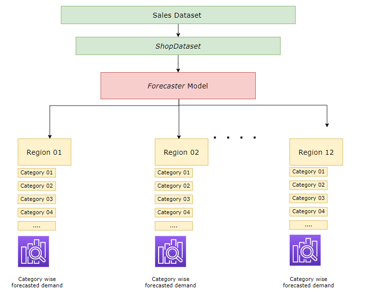

# Store sales prediction (Multiple forecasting problem)

In this task I have build sales deman forecating model for each product(M) in each region (N). Under the hood this train *MxN* models.

#### STEPS
- Raw dataset input into the $ShopDataset class$. Inside that class we can define all the preprocessing steps nesssary for modeling. At this case I'm using null value treatment and outlier treatment. When we initaite instance of $ShopDataset class$ we can call `define_regional_datsets()` method. It will intiate datasets for each regions in the raw dataset.
- After successfully creating regional datasets, we can use $ShopDataset$ instance for modeling part.
- We can do that by initiating instance of $Forecaster$. This take special parameter $dataset$, this is nothing but pre-initialized $ShopDataset$ instance.
- Now we can call familiar `.fit()` method for train all models individually. $Forecaster$ model will build `prophet` models for each product-region pairs in the raw data.

